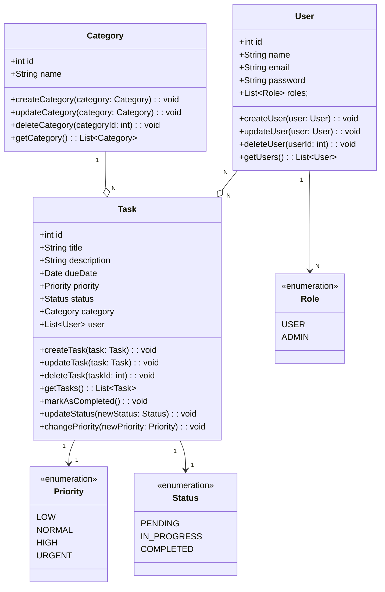

# Desafio - Claro - Java com Spring Boot

Criação de uma API Rest para gerenciamento de tarefas.

## 🚀 Principais Tecnologias
- **Java 17**
- **Spring Boot 3**
- **Spring Data JPA**
- **OpenAPI (Swagger)**
- **PostgreSQL**
- **Railway**

## Variáveis de Ambiente

Para rodar esse projeto, você vai precisar adicionar as seguintes variáveis de ambiente.

- `SPRING_PROFILES_ACTIVE` **'HML' ou 'PROD'**
- `PGHOST`
- `PGPORT`
- `PGDATABASE`
- `PGUSER`
- `PGPASSWORD`

# Diagrama

# CI/CD com Railway e Github.

