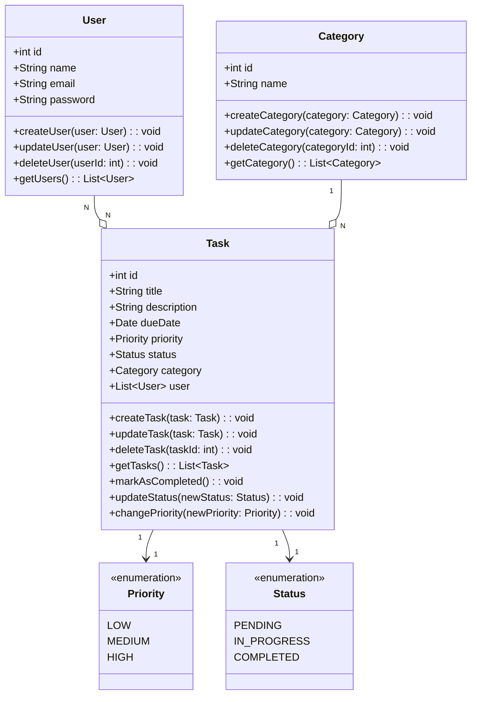

# api-task-manager

```mermaid
classDiagram
    class User {
        +int id
        +String name
        +String email
        +String password
         +createUser(user: User): void
        +updateUser(user: User): void
        +deleteUser(userId: int): void
        +getUsers(): List~User~
    }

    class Task {
        +int id
        +String title
        +String description
        +Date dueDate
        +Priority priority
        +Status status
        +Category category
        +List~User~ user
         +createTask(task: Task): void
        +updateTask(task: Task): void
        +deleteTask(taskId: int): void
        +getTasks(): List~Task~
        +markAsCompleted(): void
        +updateStatus(newStatus: Status): void
        +changePriority(newPriority: Priority): void
    }

    class Category {
        +int id
        +String name
        +createCategory(category: Category): void
        +updateCategory(category: Category): void
        +deleteCategory(categoryId: int): void
        +getCategory(): List~Category~
    }

    class Priority {
        <<enumeration>>
        LOW
        MEDIUM
        HIGH
    }

    class Status {
        <<enumeration>>
        PENDING
        IN_PROGRESS
        COMPLETED
    }

    User "N" --o "N" Task
    Category "1" --o "N" Task
    Task "1" --> "1" Priority
    Task "1" --> "1" Status
```
